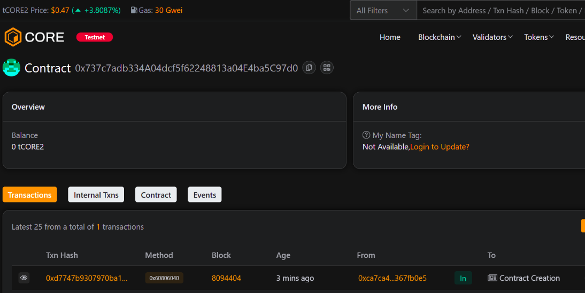

# ChainCanvas

### Project Description
ChainCanvas is an on-chain pixel canvas where users claim and update pixels by paying a fee. The contract stores pixel ownership, color, and update timestamp for a rectangular canvas. It's designed to be minimal, gas-conscious, and easy to integrate with Web3 frontends.

### Project Vision
Enable a permissionless, decentralized canvas that allows communities to express creativity and create collaborative artworks directly on-chain while keeping costs and complexity low.

### Key Features
- Payable pixel claiming — users purchase pixels by paying a per-pixel price.
- Pixel metadata stored on-chain: owner, color (24-bit 0xRRGGBB), and last updated timestamp.
- read function to fetch pixel state for frontends.
- Owner controls: withdraw accumulated funds and update price per pixel.
- Gas-focused minimal implementation for a rectangular canvas.

### Future Scope
- Layered canvases and regions with different pricing or permissions.
- Off-chain tiling & caching for efficient rendering and gallery views.
- Auctions or time-based reclaims for high-value pixels.
- Integration with NFTs (tokenize claimed pixels or regions).
- Frontend apps with collaborative drawing tools and moderation features.

### Contract address:
0x737c7adb334A04dcf5f62248813a04E4ba5C97d0
